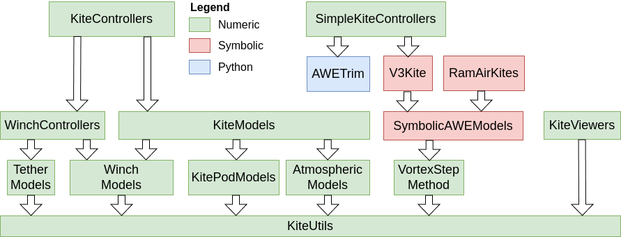

```@meta
CurrentModule = KiteUtils
```

# KiteUtils

This package is the foundation of Julia Kite Power Tools, which consist of the following packages:



## What to install
If you want to run simulations and see the results in 3D, please install the package  [KiteControllers](https://github.com/OpenSourceAWE/KiteControllers.jl) . You can use the example `autopilot.jl` of that package to run the GUI of the simulation software.
If you just want to learn how this package works quickly just install only this package.

## Installation

Install [Julia 1.12](https://ufechner7.github.io/2024/08/09/installing-julia-with-juliaup.html) or later, if you haven't already.  You can add KiteUtils from  Julia's package manager, by typing 
```julia
using Pkg
pkg"add KiteUtils"
``` 
at the Julia prompt. You can run the unit tests by typing:
```julia
pkg"test KiteUtils"
```

### Creating a project and installing the examples
You can create a demo project by typing:
```bash
mkdir demo
cd demo
julia --project=.
```
and then, on the Julia prompt type:
```julia
using Pkg
pkg"add KiteUtils"
KiteUtils.install_examples()
```
This creates the folders `data` and `examples`. You can view and modify the examples with a text editor of your choice, e.g. [notepad++](https://notepad-plus-plus.org/) if you are using Windows or `gedit` on Linux. You can execute them by typing:
```julia
menu()
```
and select one of the examples with the cursor keys and press enter.

## Provides 
- functions for coordinate system transformations
- functions for reading configuration files
- the default configuration file [settings.yaml](https://github.com/OpenSourceAWE/KiteUtils.jl/blob/main/data/settings.yaml)
- the default meta-configuration file [system.yaml](https://github.com/OpenSourceAWE/KiteUtils.jl/blob/main/data/system.yaml)
- functions for logging, reading and writing log files
- types for the state of a kite power, logging and configuration parameters
- a function for calculation the inertia matrix of a kite

## License
This project is licensed under the MIT License. The documentation is licensed under the CC-BY-4.0 License. Please see the below `Copyright notice` in association with the licenses that can be found in the file [LICENSE](https://github.com/OpenSourceAWE/KiteUtils.jl/blob/main/LICENSE).

## Copyright notice
Technische Universiteit Delft hereby disclaims all copyright interest in the package “KiteModels.jl” (models for airborne wind energy systems) written by the Author(s).

Prof.dr. H.G.C. (Henri) Werij, Dean of Aerospace Engineering, Technische Universiteit Delft.

See the copyright notices in the source files, and the list of authors in [AUTHORS.md](https://github.com/OpenSourceAWE/KiteUtils.jl/blob/main/AUTHORS.md).

## Related
- The meta package [KiteSimulators](https://github.com/aenarete/KiteSimulators.jl) which contains all packages from Julia Kite Power Tools.
- the packages [KiteModels](https://github.com/OpenSourceAWE/KiteModels.jl) and [KitePodModels](https://github.com/OpenSourceAWE/KitePodModels.jl) and [WinchModels](https://github.com/OpenSourceAWE/WinchModels.jl) and [AtmosphericModels](https://github.com/OpenSourceAWE/AtmosphericModels.jl)
- the package [KiteControllers](https://github.com/OpenSourceAWE/KiteControllers.jl) and [KiteViewers](https://github.com/OpenSourceAWE/KiteViewers.jl)

